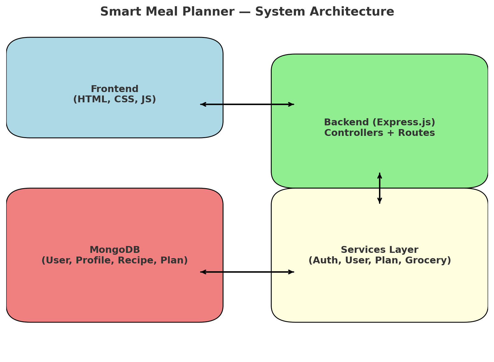

# Smart Meal Planner — Backend

## Overview

This is the backend service for the **Smart Meal Planner** project.  
It is built with **Node.js (Express.js)** and **MongoDB**, following a **domain-based modular architecture** (auth, profile, plans, recipes).

Key design choices:

- Controllers → handle requests and responses
- Services → contain business logic
- Models → Mongoose schemas for MongoDB
- Routes → define API endpoints
- Middleware → auth checks, validation, error handling

---

## Architecture Diagram

The architecture follows a clean separation of concerns:

- **Frontend (HTML, CSS, Vanilla JS)** communicates with backend APIs via `fetch`/Axios.
- **Backend (Express.js)** is split into domain modules: `auth/`, `profile/`, `plans/`, `recipes/`.
- **MongoDB** stores users, profiles, recipes, and meal plans.
- **Middleware** enforces authentication, validation, and error handling.

---

---

## Meal Plan & Recipe Module

This module lets users generate daily/weekly meal plans based on their saved preferences and recipes.

**Structure (MVC)**
server/src/mealplan/
├── mealplan.model.js # Mongoose schema for plans (daily/weekly)
├── mealplan.service.js # Business logic (generate/list/get plans)
├── mealplan.controller.js # Handles requests/responses
└── mealplan.routes.js # API routes for meal plans

server/src/recipe/
├── recipe.model.js # Schema for recipes
└── seed.js # Script to seed recipes into MongoDB

**Features**

1. Recipes stored in MongoDB with title, ingredients, dietTags, allergenTags, cuisine, costPerServing.
2. Meal Plans generated from recipes filtered by user profile (diet, allergies, cuisines, servings, weeklyBudget).
3. Supports daily (1 day × 3 meals) and weekly (7 days × 3 meals).
4. Estimated cost calculated from recipes.

**Setup**
Seed recipes into MongoDB:
nodes server/src/recipe/seed.js
npm run dev

**API (via Postman)**

1. Update Preferences
   PUT http://localhost:4000/api/profile
   { "diet":"vegetarian", "allergies":["peanut"], "cuisines":["indian"], "servings":2, "weeklyBudget":60 }
2. Generate Daily Plan
   POST http://localhost:4000/api/mealplans?type=daily
3. Generate Weekly Plan
   POST http://localhost:4000/api/mealplans?type=weekly
4. Get All Plans
   GET http://localhost:4000/api/mealplans

---
